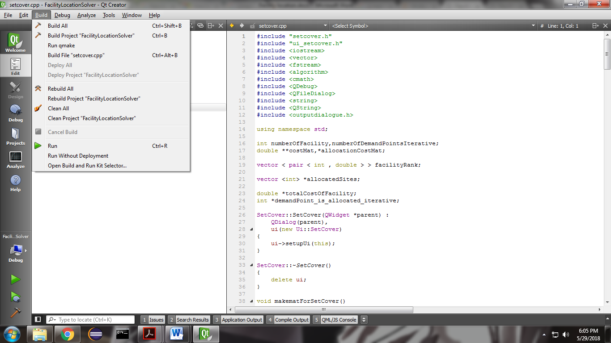
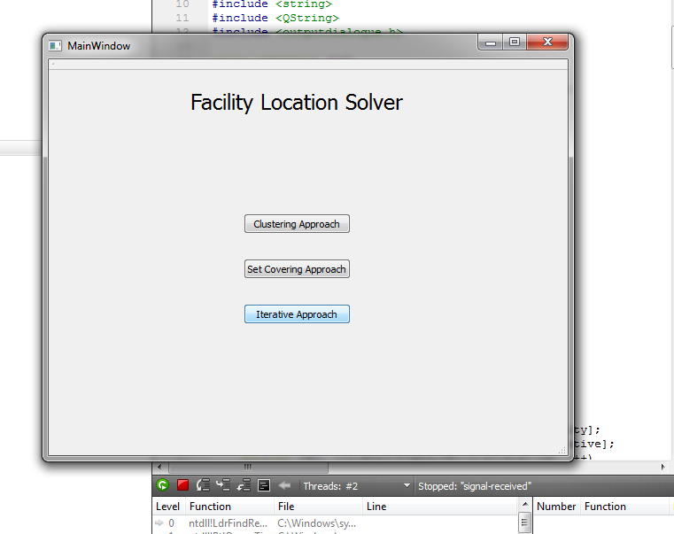
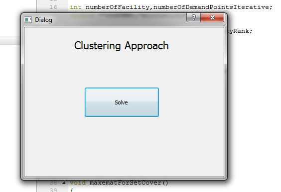
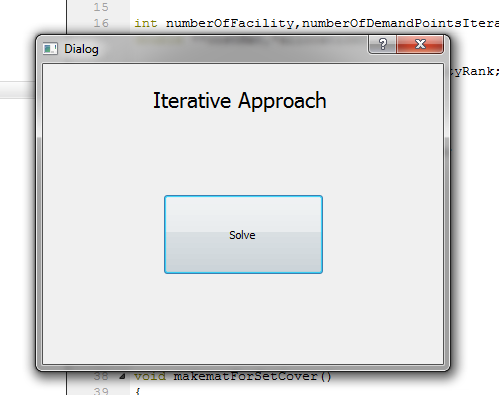
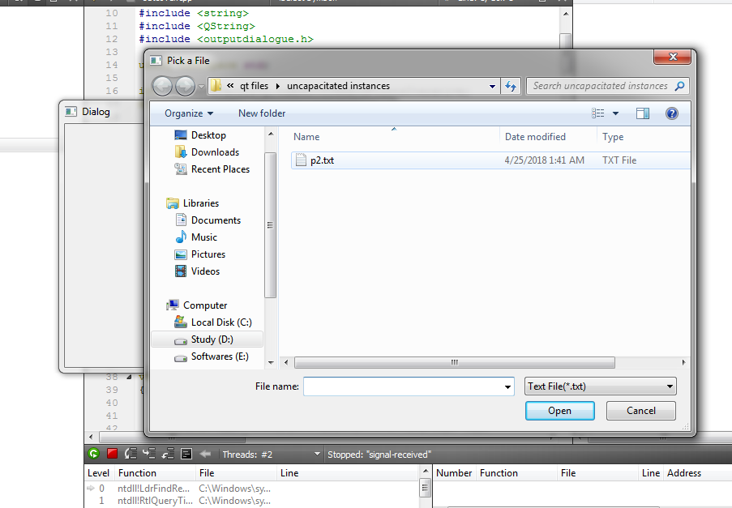
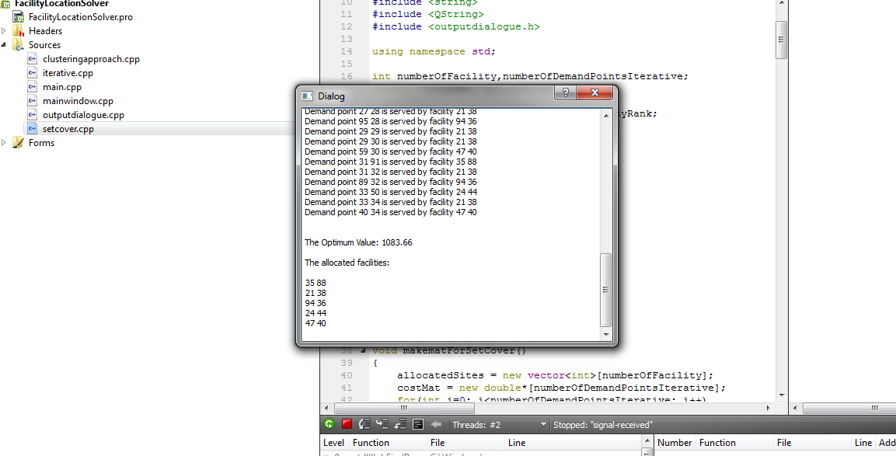

# UFLS (Uncapacitated Facility Location Problem Solver)

[](https://www.cplusplus.com/)
[](https://www.couchbase.com/products/mobile)
[](https://www.apache.org/licenses/LICENSE-2.0)

---

### Table of Contents

- [About the project](#about-the-project)
- [Built With](#built-with)
- [Application Demo](#application-demo)
- [Getting Started](#getting-started)
- [References](#references)
- [License](#license)
- [Connect With Me](#connect-with-me)

---

## About The Project 

A facility location problem is solved by finding the optimum placement of a facility in a given data set. A simple facility location problem is on general graphs is NP-hard to solve optimally, by reduction from the set cover problem The problem can be divided into 2 types of problems: Capacitated and Uncapacitated.

UFLS is a tool for solving uncapacitated facility location problems. 3 different approaches are available to solve the facility location problem:

1. Clustering Approach
2. Set Covering Approach
3. Iterative Approach

<p align="right"><a href="#">back to top</a></p>

---

## Built With

This section describes the languages and frameworks used for the project.

- [C++](https://www.cplusplus.com/)
- [QMake](https://doc.qt.io/qt-5/qmake-manual.html)
- [Qt Creator](https://www.qt.io/product/development-tools)

<p align="right"><a href="#">back to top</a></p>

---

## Application Demo

<table style="width:100%" class="center">
  <tr>
    <th colspan =  "100%">Load Qt creator to open the interface</th>
  </tr>
  <tr>
    <td></td>
    <td></td>
  </tr>
  <tr>
    <th colspan =  "100%">Pick any of the solvers!</th>
  </tr>
  <tr>
    <td></td>
    <td></td>
  </tr>
  <tr>
    <th colspan =  "100%">Pick a sample cvs file with facilities and get the results!</th>
  </tr>
  <tr>
    <td></td>
    <td></td>
  </tr>
  <tr>
</table>

<p align="right"><a href="#">back to top</a></p>

---

## Getting Started
### Installation

1. Download the Qt Creator from [here](https://www.qt.io/download-thank-you).
2. Clone the project repo
    > `git clone https://github.com/Saleh-Ibtasham/UFLS.git`
3. Run the qt program from the "qt files" [directory](https://github.com/Saleh-Ibtasham/UFLS/tree/master/SPL%201/Uncapacitated%20facility%20location%20problem%20solver/qt%20files).

### Usage

*For detailed extension instructions, please refer to the user manual section at the end of the [Documentation](https://github.com/Saleh-Ibtasham/UFLS/blob/master/SPL%201/Uncapacitated%20facility%20location%20problem%20solver/UFLS_documentation.pdf)*

<p align="right"><a href="#">back to top</a></p>

---

## References
Included here are the research articles that inspired this work:

1. [Rosing, K.E., Hillsman, E.L. and Rosing-Vogelaar, H. (1979)](https://journals.sagepub.com/doi/abs/10.1068/a110373)
2. [Zarandi, MH Fazel, et al. (2011)](https://www.sciencedirect.com/science/article/pii/S1026309811002100)
3. [Varughese, Shaju, et al. (2017)](https://papers.ssrn.com/sol3/papers.cfm?abstract_id=3826047)
4. [Adriana Bumb Ph.D. thesis](https://ris.utwente.nl/ws/portalfiles/portal/6073555/t000001e.pdf)

<p align="right"><a href="#">back to top</a></p>

---

## License

```
    Copyright (C) [Md Saleh Ibtasham]

    Licensed under the Apache License, Version 2.0 (the "License");
    you may not use this file except in compliance with the License.
    You may obtain a copy of the License at

       http://www.apache.org/licenses/LICENSE-2.0

    Unless required by applicable law or agreed to in writing, software
    distributed under the License is distributed on an "AS IS" BASIS,
    WITHOUT WARRANTIES OR CONDITIONS OF ANY KIND, either express or implied.
    See the License for the specific language governing permissions and
    limitations under the License.
```

<p align="right"><a href="#">back to top</a></p>

---

## Connect With Me

[][website]
[][linkedin]

<p align="right"><a href="#">back to top</a></p>


[website]: https://sites.google.com/view/md-saleh-ibtasham/home
[linkedin]: https://www.linkedin.com/in/saleh-ibtasham/